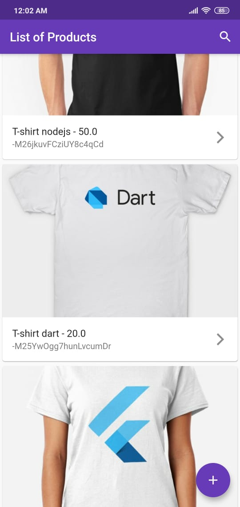
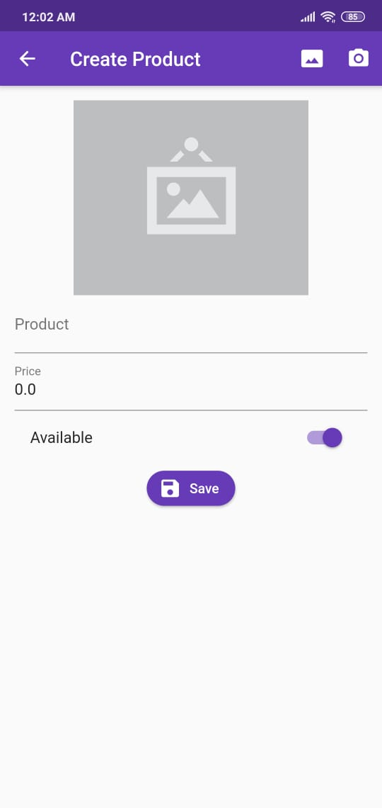
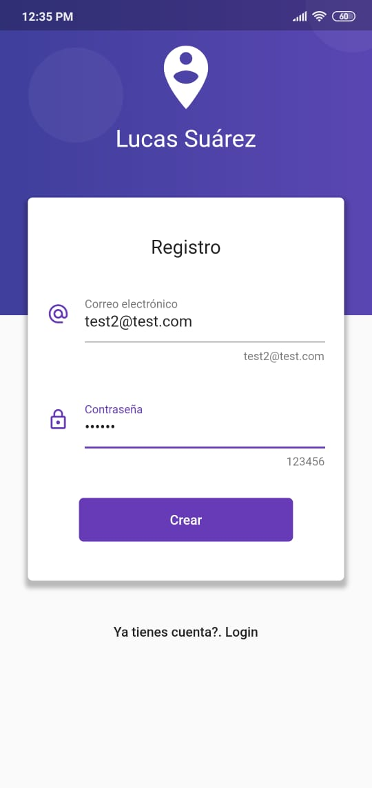
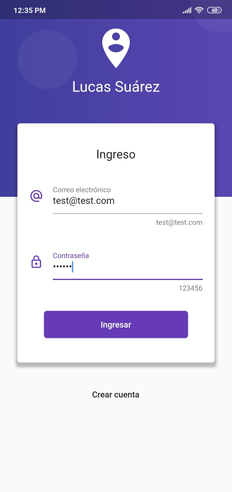

# Flutter App For Products

## Capturas
 
 

Tiene 4 pantallas:
- List of Products: que muestra todos los productos.
- Create Producto: Crear un producto, se puede subir una imagen o tomar
un foto con la camara del telefono.
- Login: Logeo con Firebase Auth.
- Registro: Crear una cuenta con email y password con Firebase.

## Getting Started

This project is a starting point for a Flutter application.

A few resources to get you started if this is your first Flutter project:

- [Lab: Write your first Flutter app](https://flutter.dev/docs/get-started/codelab)
- [Cookbook: Useful Flutter samples](https://flutter.dev/docs/cookbook)

For help getting started with Flutter, view our
[online documentation](https://flutter.dev/docs), which offers tutorials,
samples, guidance on mobile development, and a full API reference.
